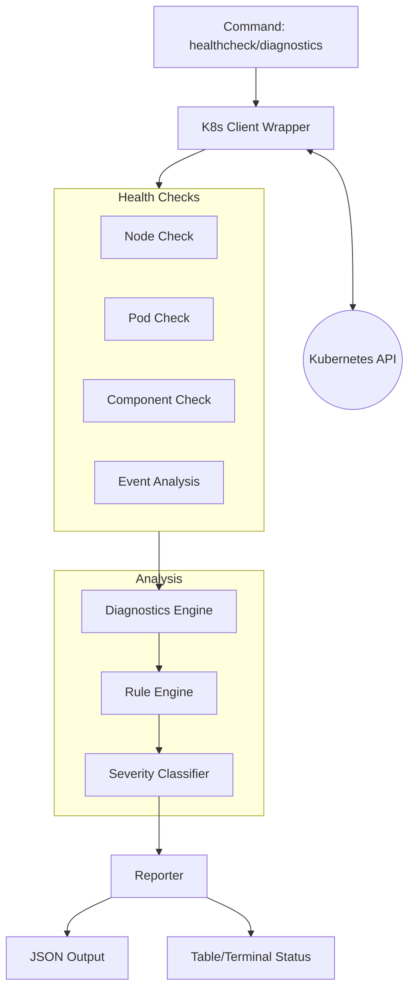
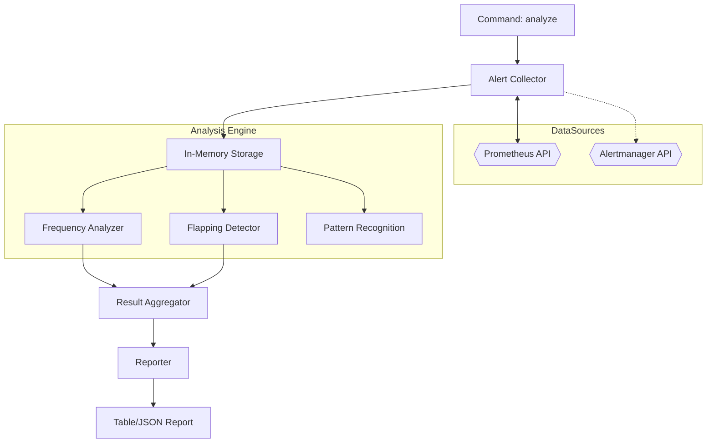
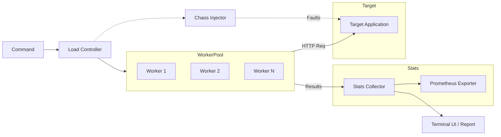
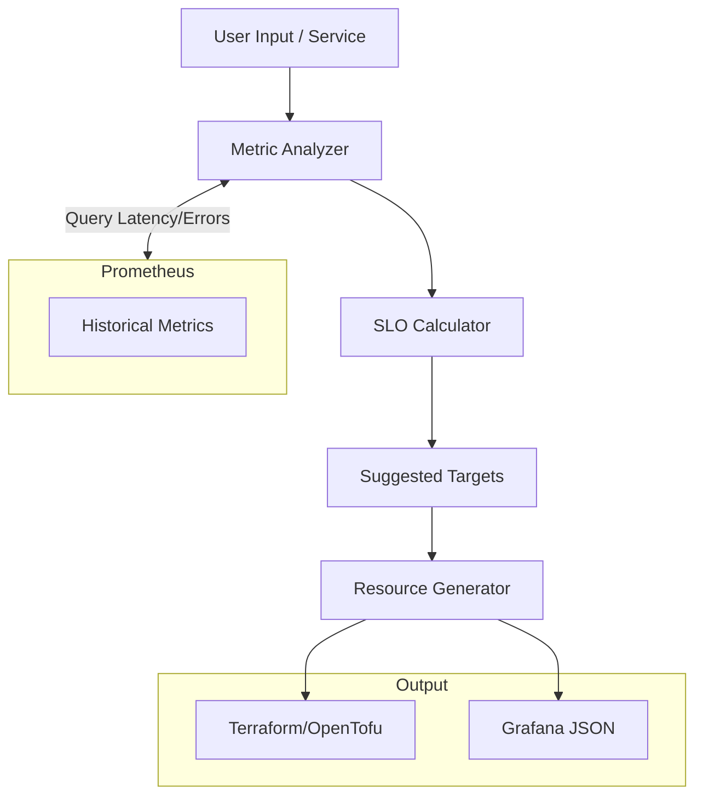
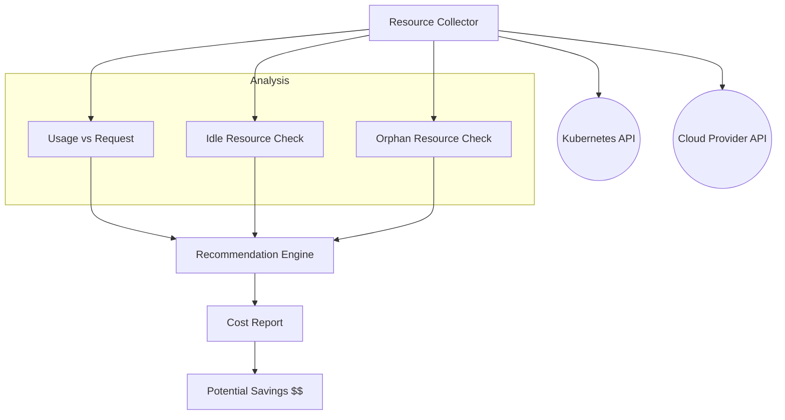
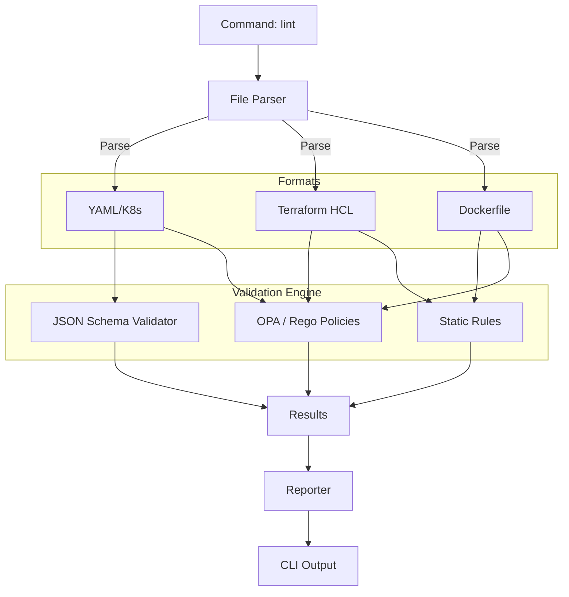
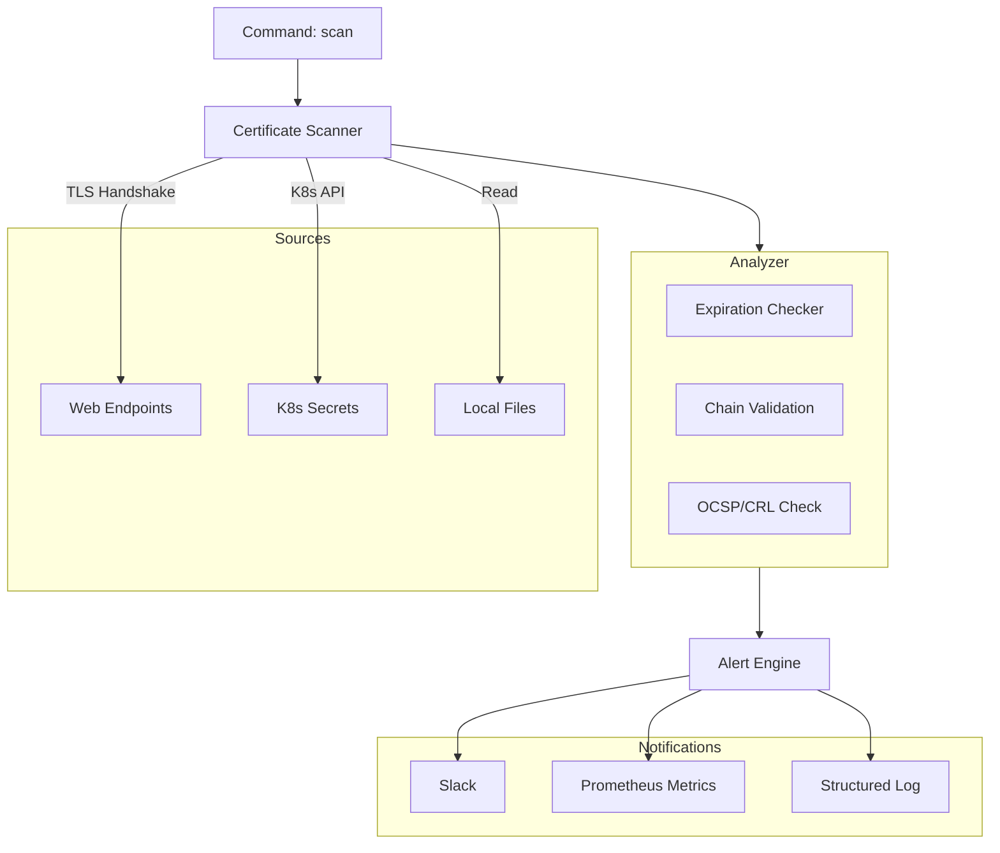
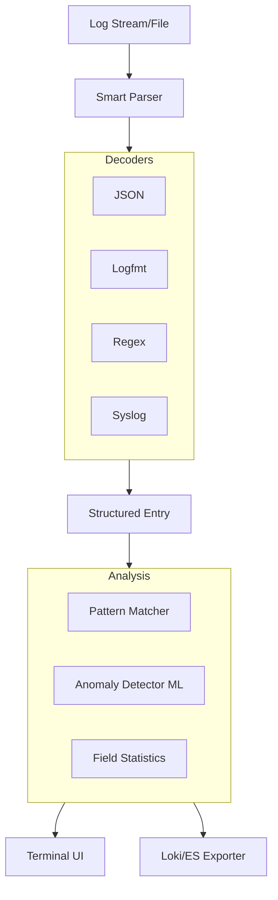
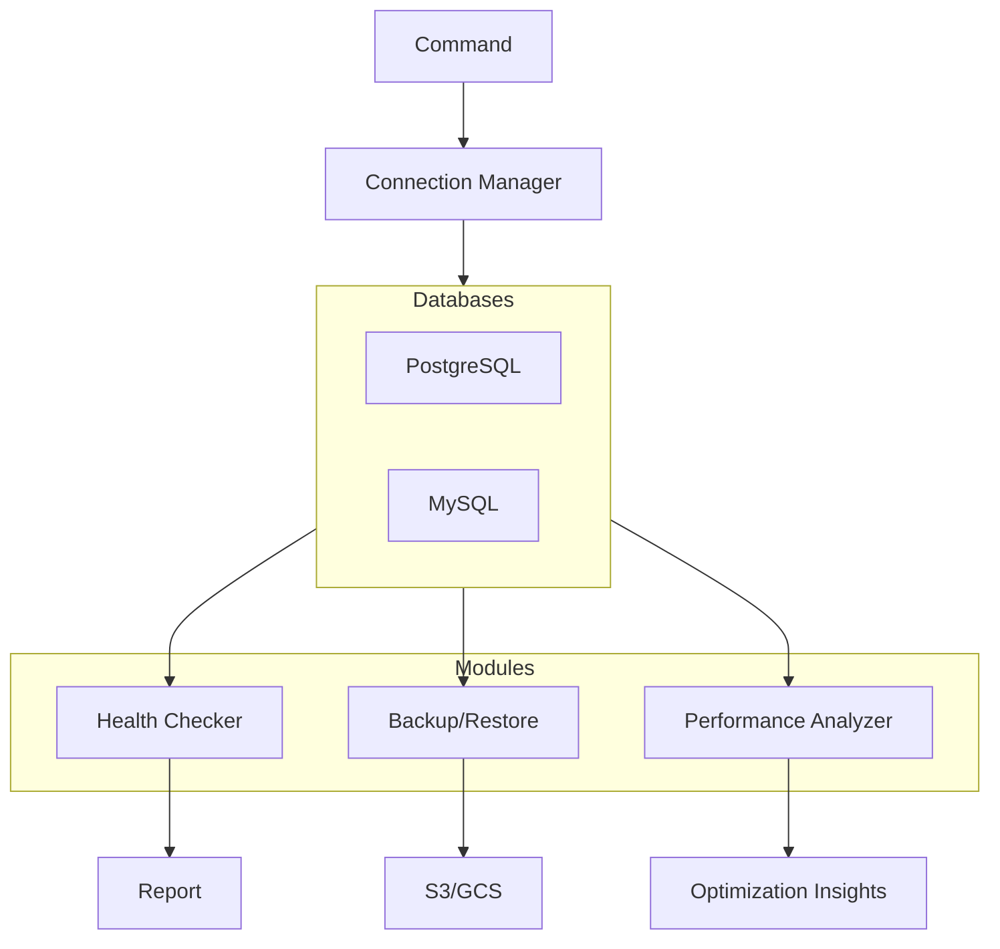

# SRE Toolkit - Architecture

This document describes the high-level architecture of the tools in the SRE Toolkit.

## High Level Overview

All tools share a common CLI framework based on Cobra and Viper, using a shared internal library structure for consistency.

```mermaid
graph TD
    User[User] --> CLI[CLI Framework (Cobra)]
    CLI --> Config[Config (Viper)]
    CLI --> Logger[Logger (Zerolog)]
    
    subgraph Shared[Shared Packages]
        Config
        Logger
        Metrics[Prometheus Metrics]
    end
    
    CLI --> ToolLogic[Tool Specific Logic]
    ToolLogic --> Shared
```

## Tools Architecture

### 1. k8s-doctor

The `k8s-doctor` tool is designed to diagnose Kubernetes cluster issues by running a series of health checks and diagnostics.



### 2. alert-analyzer

`alert-analyzer` connects to Prometheus to fetch historical alert data and performs statistical analysis to identify noise.



### 3. chaos-load

`chaos-load` generates load while optionally injecting chaos faults. It uses a worker pool pattern for concurrency.



### 4. slo-gen (Proposed)

Architecture for the proposed SLO generator tool.



### 5. cost-optimizer (Proposed)

Architecture for the cost optimization tool.



### 6. config-linter (Coming Soon)

Architecture for the multi-format configuration linter.



### 7. cert-monitor (Coming Soon)

Architecture for SSL/TLS certificate monitoring.



### 8. log-parser (Coming Soon)

Architecture for the smart log parser and analyzer.



### 9. db-toolkit (Coming Soon)

Architecture for the database operations helper.


